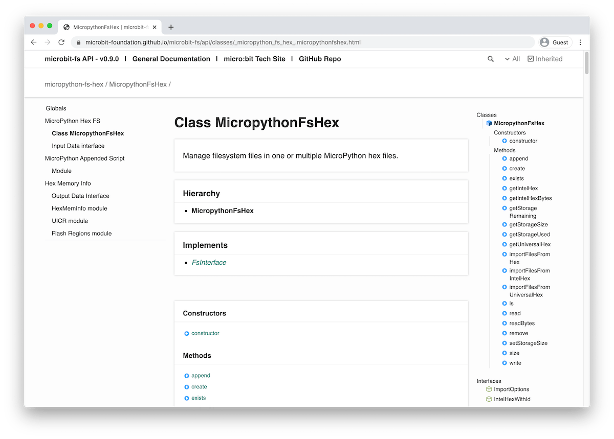

# API Documentation

The API documentation is generated independently of the rest of these docs and
can be found in this URL:
[https://microbit-foundation.github.io/microbit-fs/api/](https://microbit-foundation.github.io/microbit-fs/api/)

[Click here to go to the API docs](api/){: .btn .btn-purple }

The source code is well annotated with docstring and
[TypeDoc](http://typedoc.org) is used to generate the API pages.

