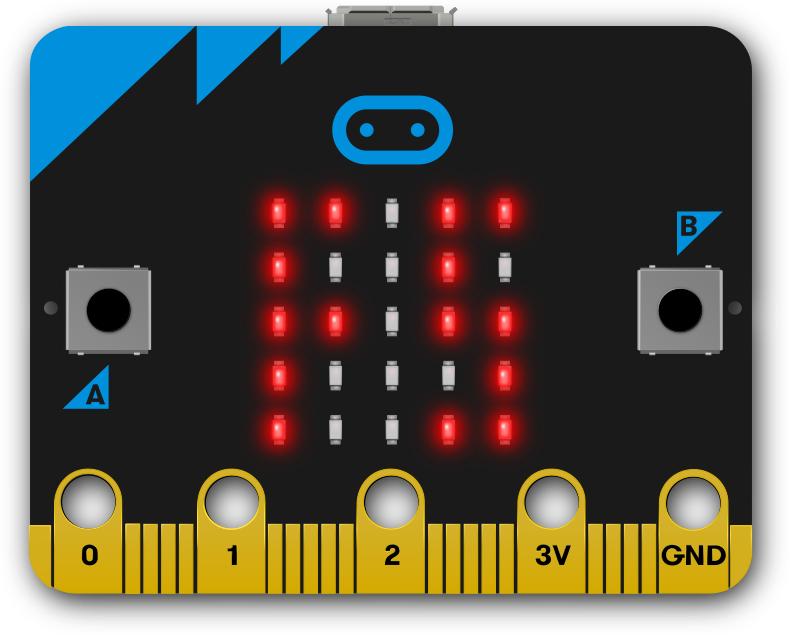

## Introduction

This library can be used to add files with Python code (or any other content)
into a MicroPython hex file, ready to be loaded into a micro:bit.

The reverse process is also supported, being able to read the files encoded in
the MicroPython filesystem from a hex file.

This library can also generate [Universal
Hex](https://github.com/microbit-foundation/spec-universal-hex) files to create
a singe hex that can be loaded in any micro:bit board.

## Getting started

Read the [Quick guide](./quick-guide.md).

## Related documentation

- [MicroPython user docs page for filesystem](https://microbit-micropython.readthedocs.io/en/v1.0.1/filesystem.html)
- [The micro:bit Tech Site contains general technical information about the
  micro:bit](https://tech.microbit.org)

## License

This documentation, as well as the rest of the source files located in the
[GitHub repository](https://github.com/microbit-foundation/microbit-fs), is
released under the MIT open source license.

SPDX-License-Identifier: MIT